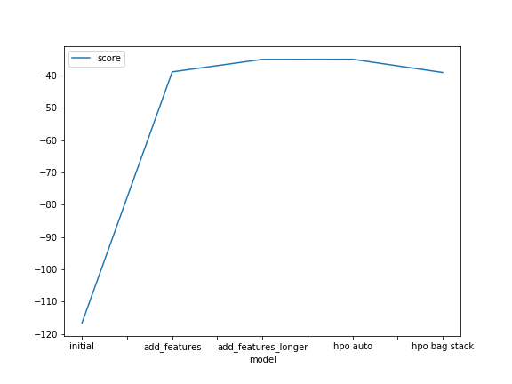
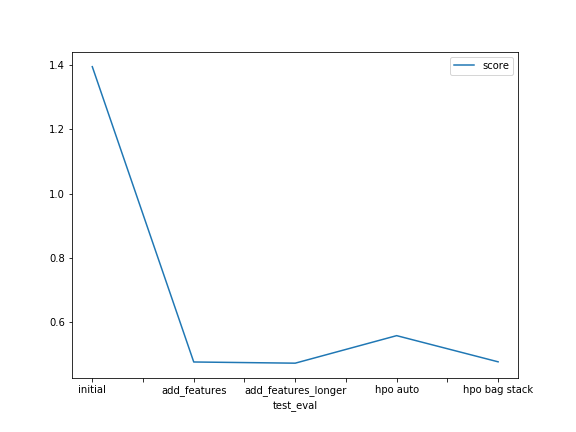

# Report: Predict Bike Sharing Demand with AutoGluon Solution
#### Matthias Budde

## Initial Training
### What did you realize when you tried to submit your predictions? What changes were needed to the output of the predictor to submit your results?
I assume you mean that Kaggle does not accept counts below 0? However, on my first AutoGluon run, coincidentally no negative values occurred. Still, I added the appropriate code to remove values <0, which I later needed for other predictors.

Another change I had to make before I could predict at all was to drop the columns `casual` and `registered` from the training dataset, since they were not part of the test dataset.

### What was the top ranked model that performed?
According to the `leaderboard()` function output, the top model was the level 3 ensemble ('WeightedEnsemble_L3'), wich seems logical, since it uses the other models and adds weights to improve performance. This is the model that is actually used, illustrated by the fact that using `fit()` with the parameter `model = 'WeightedEnsemble_L3'` produces the same scores as without any constraints on what model to use.

## Exploratory data analysis and feature creation
### What did the exploratory analysis find and how did you add additional features?
I found that the data points are not evenly distributed among months (more data in January and December) and time of day (less data points around 9 AM). I added 'hour', 'day' and 'month' as additional features, as suggested. This improved performance drastically.

### How much better did your model preform after adding additional features and why do you think that is?
The kaggle score improved (i.e. the RSMLE decreased) drastically from 1.39479 to 0.47675. I believe that the reason for this that the datetime is non-cyclic (i.e. every date-time combination occurs exactly once) while the day of the month and the hour of the day repeat every day and thus capture the underlying usage patterns. 

## Hyper parameter tuning
### How much better did your model preform after trying different hyper parameters?
It didn't. I tried different HPO approaches, from changing the automatic hyperparameter tuning to manually specifying bag folds and stack levels. Hovever, performace dropped or stayed more or less the same compared to the dataset with added features and automatic HPO. 

This is not entirely surprising to me, as the AutoGluon documentation/tutorial states that in order to maximize predictive performance of an ensemble, it is recommended to "_allow AutoGluon to adaptively select which models/hyperparameters to use_" as "_counterintuitively, hyperparameter tuning is not the best way to spend a limited training time budgets, as model ensembling is often superior_" (see https://auto.gluon.ai/stable/tutorials/tabular_prediction/tabular-quickstart.html#maximizing-predictive-performance).

### If you were given more time with this dataset, where do you think you would spend more time?
I believe I would spend more time on data exploration and cleaning to try to improve performance as well on playing around more with HPO to see if I can somehow get a better feeling on what and how to tune.

### Create a table with the models you ran, the hyperparameters modified, and the kaggle score.
|model               |features |time_limit |bag folds |stack levels |kaggle score|
|--------------------|---------|-----------|----------|-------------|------------|
|initial             |9        |60         |auto      |auto         |1.39479     |
|add_features        |12       |60         |auto      |auto         |0.47675     |
|add_features_longer |12       |1200       |auto      |auto         |0.47306     |
|hpo auto            |12       |1200       |auto      |auto         |0.55864     |
|hpo bag stack       |12       |60         |10        |3            |0.47727     |

### Create a line plot showing the top model score for the three (or more) training runs during the project.

### Create a line plot showing the top kaggle score for the three (or more) prediction submissions during the project.

## Summary
I found the excercise interesting and it illustrated some important aspects (like feature selection/engineering) very well. While I could follow the lessons on HPO, the matter remained a bit elusive throughout the project, since I could not produce better results than what was automatically delivered by using AutoGluon without explicit optimization. 
